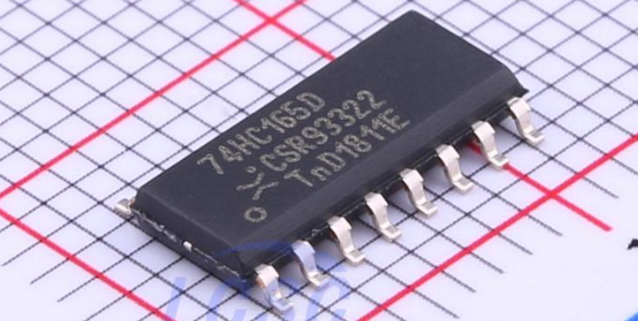

<center>


Created by Ouroboros Embedded Education.
</center>

## Versions Changelog

V1.0.0

- Initial Release

# 74xx165 Library Documentation

<center></center>

This documentation describes the **74xx165** C library, which provides a hardware-abstracted interface to control and read data from 74xx165 parallel-in serial-out shift registers (such as 74HC165, 74LS165, etc.). The library is designed for embedded systems and allows reading multiple cascaded devices using SPI and GPIO.

---

## Table of Contents

- [74xx165 Library Documentation](#74xx165-library-documentation)
  - [Table of Contents](#table-of-contents)
  - [Overview](#overview)
  - [Features](#features)
  - [File Structure](#file-structure)
  - [Data Structures](#data-structures)
    - [Error Codes](#error-codes)
    - [Function Pointer Typedefs](#function-pointer-typedefs)
    - [Handler Structure](#handler-structure)
    - [Initialization Parameters](#initialization-parameters)
  - [API Reference](#api-reference)
    - [Initialization](#initialization)
    - [Read Byte](#read-byte)
    - [Read Bit](#read-bit)
  - [Usage Example](#usage-example)
  - [Customization](#customization)
  - [License](#license)

---

## Overview

The **74xx165** library abstracts the process of reading parallel inputs from one or more 74xx165 shift registers via SPI. It allows you to connect multiple devices in series and provides thread-safe (mutex-protected) access if needed. The library is hardware-independent: you supply function pointers for SPI, GPIO, and optional mutex operations.

---

## Features

- Supports multiple cascaded 74xx165 devices.
- Hardware abstraction via user-supplied function pointers.
- Thread-safe operation with optional mutex lock/unlock.
- Efficient byte and bit read routines.
- Flexible buffer management (internal or user-supplied).

---

## File Structure

- `l74xx165.h` – Main API header.
- `l74xx165.c` – Implementation file.
- `l74xx165_defs.h` – Reserved for future definitions.

---

## Data Structures

### Error Codes

```c
typedef enum {
    L74XX165_OK,
    L74XX165_FAIL
} l74xx165_err_e;
```


### Function Pointer Typedefs

```c
typedef void    (*l74xx165_gpio_t)(bool sig);                // GPIO control (CS, LOAD)
typedef void    (*l74xx165_mtx_t)(void);                     // Mutex lock/unlock
typedef uint8_t (*l74xx165_spi_t)(uint8_t *bff, uint8_t len); // SPI receive
```


### Handler Structure

```c
typedef struct {
    struct {
        l74xx165_spi_t   fxnSpiReceived;
        l74xx165_gpio_t  fxnGpioCS;
        l74xx165_gpio_t  fxnGpioLoad;
        l74xx165_mtx_t   fxnMtxLock;
        l74xx165_mtx_t   fxnMtxUnlock;
    } fxns;
    bool     bInitialized;
    uint8_t  u8NumberOfDevices;
    uint8_t *pu8IntBuffer;
} l74xx165_t;
```


### Initialization Parameters

```c
typedef struct {
    l74xx165_spi_t   fxnSpiReceived;
    l74xx165_gpio_t  fxnGpioCS;
    l74xx165_gpio_t  fxnGpioLoad;
    l74xx165_mtx_t   fxnMtxLock;
    l74xx165_mtx_t   fxnMtxUnlock;
    uint8_t          u8NumberOfDevices;
    uint8_t         *pu8ExtBuffer; // Optional: user-supplied buffer
} l74xx165_params_t;
```


---

## API Reference

### Initialization

```c
l74xx165_err_e l74xx165_init(l74xx165_t *handler, l74xx165_params_t *params);
```

**Description:**
Initializes the 74xx165 handler. Checks all required function pointers and parameters. Allocates an internal buffer if the user does not supply one.

- `handler`: Pointer to the handler structure.
- `params`: Pointer to the initialization parameters.
- **Returns:** `L74XX165_OK` on success, `L74XX165_FAIL` on error.

---

### Read Byte

```c
l74xx165_err_e l74xx165_read_byte(l74xx165_t *handler, uint8_t Index, uint8_t *ReadedByte);
```

**Description:**
Reads a byte from the specified shift register in the chain.

- `handler`: Pointer to the handler.
- `Index`: Index of the device (0 = first device in chain).
- `ReadedByte`: Pointer to store the read byte.
- **Returns:** `L74XX165_OK` on success, `L74XX165_FAIL` on error.

---

### Read Bit

```c
l74xx165_err_e l74xx165_read_bit(l74xx165_t *handler, uint8_t Index, uint8_t bit, bool *Readedbit);
```

**Description:**
Reads a single bit from the specified device and bit position.

- `handler`: Pointer to the handler.
- `Index`: Index of the device (0 = first device in chain).
- `bit`: Bit position (0-7).
- `Readedbit`: Pointer to store the bit value (`true` or `false`).
- **Returns:** `L74XX165_OK` on success, `L74XX165_FAIL` on error.

---

## Usage Example

```c
#include "l74xx165.h"

// User must implement these functions for their hardware:
void my_gpio_cs(bool sig);
void my_gpio_load(bool sig);
uint8_t my_spi_receive(uint8_t *buffer, uint8_t len);
void my_mutex_lock(void);
void my_mutex_unlock(void);

l74xx165_t shift_handler;
l74xx165_params_t params = {
    .fxnSpiReceived = my_spi_receive,
    .fxnGpioCS      = my_gpio_cs,
    .fxnGpioLoad    = my_gpio_load,
    .fxnMtxLock     = my_mutex_lock,   // Optional
    .fxnMtxUnlock   = my_mutex_unlock, // Optional
    .u8NumberOfDevices = 2,            // For two cascaded 74xx165 chips
    .pu8ExtBuffer   = NULL             // Use internal buffer
};

void setup(void) {
    if (l74xx165_init(&amp;shift_handler, &amp;params) == L74XX165_OK) {
        uint8_t value;
        if (l74xx165_read_byte(&amp;shift_handler, 0, &amp;value) == L74XX165_OK) {
            // value now contains the parallel inputs of the first device
        }
        bool bitval;
        if (l74xx165_read_bit(&amp;shift_handler, 1, 3, &amp;bitval) == L74XX165_OK) {
            // bitval now contains the value of bit 3 of the second device
        }
    }
}
```


---

## Customization

- **SPI, GPIO, Mutex:**
Implement the hardware-specific functions for your microcontroller or platform.
- **Buffer:**
Provide your own buffer via `pu8ExtBuffer` or let the library allocate one.
- **Thread Safety:**
Use mutex functions if accessing from multiple threads.

---

## License

See the source files for license information.
Author: Pablo Jean (pablo-jean), August 2024

---

**For further details, refer to the code and comments in the provided source files.**